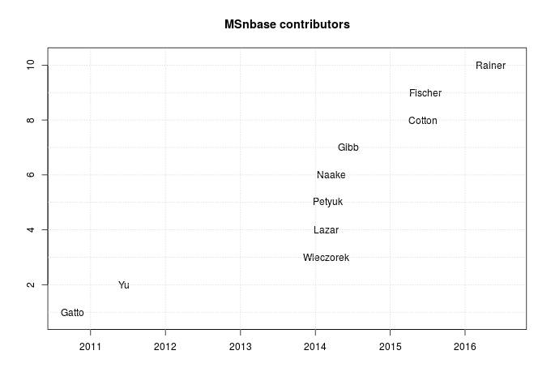

[MSnbase](http://bioconductor.org/packages/release/bioc/html/MSnbase.html)
(or [here](https://github.com/lgatto/MSnbase/) on GitHub)
([Gatto and Lilley, 2010](https://www.ncbi.nlm.nih.gov/pubmed/22113085))
is on of my main software projects that I started when I moved to
Cambridge in
2010. It offers a way to import, manipulate and process raw mass
spectrometry and quantitative proteomics data in R.

Since then, I benefited from quite a few contributions (which I
already briefly highlighted
[here](http://lgatto.github.io/cpu-spat-prot-2015)). In this post, I
want to give a few more details about and credit to the contributors.

<!--more-->

The figure below summarises the contributors over time. 

The first data point on the plot is Mon Oct 4 23:35:23 2010, and
corresponds to the very first git commit (with typo) in the
[GitHub repository](https://github.com/lgatto/MSnbase/):


commit 7cb6b1a598d0b2ed55234f75229b925ceb26afaa
Author: Laurent Gatto <laurent.gatto@gmail.com>
Date:   Mon Oct 4 23:35:23 2010 +0100

    Inital commit - package dir structure and R code
    
    All the R code files, some with roxygen incode documentation
    as well as the R package structure are committed. Included
    are also DESCRIPTION, NAMESPACE, NEWS (empty) and README.org.
    A dataset in mzXML format, dummyiTRAQ.mzXML in inst/extdata
    will serve as testing file.


Since then, the commits have been quite regular, except for 2012.

### Guangchuang Yu 

Guangchuang contributed the `plotMzDelta` function in June 2011. The
function produces a figure used as a quality for MS2 spectra, as
detailed in
[Foster et al. 2011](https://www.ncbi.nlm.nih.gov/pubmed/21538885). All
differences between neighbouring peaks in MS2 spectra are calculated
and plotted as a histogram. Assuming good peptide fragmentation and
absence of contamination, the histogram should feature peaks
corresponding to amino acids.

### Samuel Wieczorek and Cosmin Lazar

The contributions of Sam and Cosmin in February 2014 stem from our
work on missing value imputation in quantitative proteomics
([Lazar et al. 2016](https://www.ncbi.nlm.nih.gov/pubmed/26906401))
and have materialised in improvements in the `impute` function.

### Vlad Petyuk 

Vlad's main contrition was in the `combineFeatures` function that
aggregates low level features, in March 2014. He contributed the
*redundancy handler*, that defines how to handle peptides that can be
associated to multiple higher-level features (proteins).

The `ggplot2`-based implementation of `image`, that produces a simple
heatmap of the quantitative data also come from him, and is based on
his own `vp.misc::image_msnset` implementation. 

### Thomas Naake 

Thomas visited the group as an Erasmus student from April to June 2014
and implemented the first version of the
[`pRolocGUI`](http://www.bioconductor.org/packages/release/bioc/html/pRolocGUI.html)
package (and
[here](https://github.com/ComputationalProteomicsUnit/pRolocGUI) on
GitHub). During this work, we discussed about features that would be
needed for the interactive visualisation that ended up being
implemented/added to `MSnbase` and then used in the GUIs. The main one
I can remember is the `FreaturesOfInterest` class, that stores an
arbitrary set of features (proteins) that can then conveniently
highlighted on a PCA plot using the `highlightOnPlot` function from
the `pRoloc` package.


library("pRolocdata")
data("tan2009r1")
x <- FeaturesOfInterest(description = "A test set of features of interest",
                        fnames = featureNames(tan2009r1)[1:10],
                        object = tan2009r1)
plot2D(tan2009r1)
highlightOnPlot(tan2009r1, x)
highlightOnPlot(tan2009r1, x, labels = TRUE, pos = 3)


### Sebastian Gibb

Sebastian visited the group for 3 months in 2014. He did a lot of work
on `MSnbase` and
[`synapter`](http://bioconductor.org/packages/release/bioc/html/synapter.html)
([here](https://github.com/lgatto/synapter)) and is still
active. Among his many contributions are the `addIdentificationData`,
that adds identification data from `mzid` files to raw (`MSnExp`
objects) and quantitative (`MSnSet` objects) data. He also added
various raw data processing functions (such as smoothing, peak
picking) by leveraging existing code in his
[`MALDIQuant`](https://cran.r-project.org/web/packages/MALDIquant/)
package and support for label-free MS2 quantitation. He also worked on
spectra comparison, annotation and visualisation, as illustrated
below.

### Richie Cotton 

Richie contributed in supporting `mzTab` version 1.0, as described in
[issue #41](https://github.com/lgatto/MSnbase/issues/41) from
June 2015. I updated his code to fit into the `MSnbase` infrastructure
and annotate some the ontology controlled parameters (using the
[`rols`](http://bioconductor.org/packages/release/bioc/html/rols.html)
package).

### Martina Fischer

In June 2015, Martina contributed a whole new method for feature
aggregation, termed *iPQF* (for Isobaric Protein Quantification based
on Features)). *iPQF* is a new peptide-to-protein summarisation method
using peptide spectra characteristics to improve protein
quantification. All details in
[Fischer and Renard, 2016](https://www.ncbi.nlm.nih.gov/pubmed/26589272),
readily available using `combineFeatures(..., method = "iPQF")`.

### Johannes Rainer

Johannes has been instrumental in the recent (October 2016) release of
`MSnbase` version 2.0. During summer 2016, we worked on a new backend
for raw data. Instead of loading spectra into memory, as in the
original `MSnExp` implementation, the alternative implementation
accesses the raw data from the hard drive on-the-fly only when it is
needed. This is made possible by the fast on-disk access provided by
the
[`mzR`](http://bioconductor.org/packages/release/bioc/html/mzR.html)
package ([here](https://github.com/sneumann/mzR/) on GitHub) that uses
the [proteowizard](http://proteowizard.sourceforge.net/) C/C++ code
base under the hood. For more details and a direct comparison, see the
[benchmarking](http://bioconductor.org/packages/release/bioc/vignettes/MSnbase/inst/doc/benchmarking.html)
vignette.

This joint work with Johannes aims at providing a common and efficient
infrastructure for mass spectrometry data that can be used by the
proteomics and metabolomics developers.

Seeing that `MSnbase` is used and attracts attention from other
developers is a great reward for me. Thank you all for your valuable
contributions!
